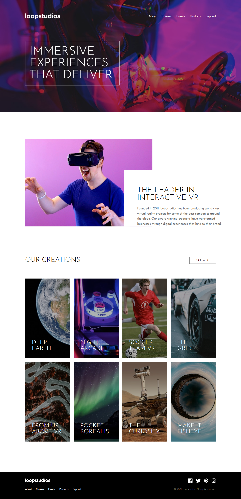

## Table of contents

- [Screenshot](#screenshot)
- [Links](#links)
- [My process](#my-process)
  - [Built with](#built-with)
  - [Continued development](#continued-development)
  - [Useful resources](#useful-resources)
- [Author](#author)

### Screenshot

### Links

- Solution URL: [Add solution URL here]()
- Live Site URL: [Add live site URL here](https://loopstudios-15.netlify.app/)

## My process

### Built with

- Semantic HTML5 markup
- CSS custom properties
- Flexbox
- CSS Grid
- Mobile-first workflow

### Continued development

I'm going to continue learning how to use relative and absolute positioning. I'm also going to learn more about styling ::before and ::after pseudo elements. I struggled a bit with giving the underline effect on the links.

### Useful resources

- [Example resource 1](https://www.youtube.com/watch?v=our2WMvPegM) - This helped me learn how to give the links and underline effect when hovering.

## Author

- Frontend Mentor - [@alyssasitto](https://www.frontendmentor.io/profile/alyssasitto)
